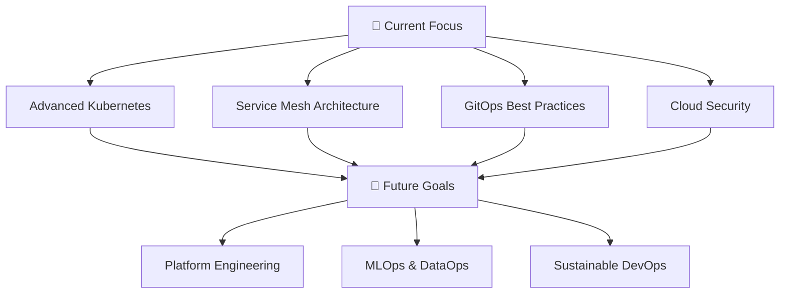

# <div align="center">🚀 Welcome to My DevOps Universe 🚀</div>

<div align="center">
  
</div>

<div align="center">
  
</div>

<br/>

<div align="center">
  
</div>

---

<div align="center">

## 🎭 **Digital Identity Matrix**


</div>

---

<table align="center">
<tr>
<td valign="center" width="50%">

### 🎯 **Mission Statement**
```yaml
role: "DevOps Engineer & Cloud Architect"
mission: "Bridging Development & Operations"
passion: "Automation, Scalability, Reliability"
philosophy: "You build it, you run it, you own it"
status: "Continuously Learning & Evolving"
```

### 🔥 **Current Focus**
- 🌩️ **Multi-Cloud Architecture Design**
- 🔄 **GitOps & Infrastructure as Code**
- 🛡️ **DevSecOps Implementation**
- 📊 **Observability & SRE Practices**
- 🤖 **MLOps & Data Pipeline Automation**

</td>
<td valign="center" width="50%">

### 📈 **Professional Stats**
```typescript
const vasu: DevOpsEngineer = {
  experience: "Building scalable systems",
  expertise: ["AWS", "Kubernetes", "Terraform"],
  currentlyLearning: "Advanced Service Mesh",
  collaborating: "Open Source DevOps Tools",
  askMeAbout: "Cloud Infrastructure & Automation",
  funFact: "I automate my entire morning routine! ☕"
};
```

### 🎪 **Specializations**
- **🏗️ Infrastructure Automation**
- **🚀 CI/CD Pipeline Architecture**  
- **☁️ Cloud-Native Solutions**
- **📊 Monitoring & Alerting**
- **🔐 Security & Compliance**

</td>
</tr>
</table>

---

<div align="center">

## 🛠️ **Technology Arsenal**


</div>

<div align="center">

### ☁️ **Cloud Platforms & Services**


### 🐳 **Containerization & Orchestration**  


### 🏗️ **Infrastructure as Code & Configuration**


### 🔄 **CI/CD & DevOps Tools**


### 📊 **Monitoring, Logging & Observability**


### 💻 **Operating Systems & Scripting**


### 🗄️ **Databases & Storage**


</div>

---

<div align="center">

## 📊 **Performance Analytics Dashboard**


</div>

<div align="center">
<table>
<tr>
<td align="center" width="50%">

**📈 GitHub Statistics**


</td>
<td align="center" width="50%">

**🔥 Contribution Streak**


</td>
</tr>
</table>

**💻 Language Distribution**


</div>

---

<div align="center">

## 🏆 **Achievement Gallery**


</div>

<div align="center">

### 🎖️ **Certifications & Badges**


### 🏅 **Learning Milestones**
- 🎯 **90 Days of DevOps Challenge** - Completed with Excellence
- 📚 **Linux Foundation Training** - Kubernetes Fundamentals  
- 🚀 **AWS Well-Architected Framework** - Expert Level
- 🔐 **DevSecOps Foundation** - Security Integration
- 📊 **Site Reliability Engineering** - Google SRE Practices

</div>

---

<div align="center">

## 🎭 **Activity Visualization**


</div>


---

<div align="center">

## 🌟 **DevOps Philosophy & Mindset**


</div>

<div align="center">
<table>
<tr>
<td align="center" width="33%">

### 🔄 **Automation First**
*"Automate repetitive tasks to focus on innovation and strategic problem-solving"*

**Core Principles:**
- Infrastructure as Code
- Configuration Management
- Continuous Integration
- Automated Testing

</td>
<td align="center" width="33%">

### 📊 **Measure Everything**
*"You can't improve what you don't measure - observability is key to reliability"*

**Key Metrics:**
- System Performance
- Application Health
- User Experience
- Business Impact

</td>
<td align="center" width="33%">

### 🤝 **Collaborate & Share**
*"Breaking down silos between teams creates better software and happier developers"*

**Culture Focus:**
- Knowledge Sharing
- Cross-functional Teams
- Continuous Learning
- Open Communication

</td>
</tr>
</table>
</div>

---

<div align="center">

## 🚀 **Let's Build the Future Together**


### 🎯 **Open for Collaboration**

Whether you're interested in:
- 🤖 **Automating Infrastructure**
- ☁️ **Cloud Architecture Design** 
- 🔄 **CI/CD Pipeline Optimization**
- 📊 **Monitoring & Observability**
- 🔐 **DevSecOps Implementation**
- 📚 **Knowledge Sharing & Mentoring**

I'm always excited to connect with fellow tech enthusiasts!

</div>

<div align="center">

### 📬 **Connect With Me**

<a href="mailto:your-email@domain.com">
  
</a>
<a href="your-linkedin-url">
  
</a>
<a href="your-twitter-url">
  
</a>
<a href="your-portfolio-url">
  
</a>

</div>

---

<div align="center">

### 💭 **Current Learning Journey**


```mermaid
graph TD
    A[🎯 Current Focus] --> B[Advanced Kubernetes]
    A --> C[Service Mesh Architecture]
    A --> D[GitOps Best Practices]
    A --> E[Cloud Security]
    
    B --> F[🚀 Future Goals]
    C --> F
    D --> F
    E --> F
    
    F --> G[Platform Engineering]
    F --> H[MLOps & DataOps]
    F --> I[Sustainable DevOps]
```

</div>

---

<div align="center">


### ⭐ **"If you find my work valuable, please consider starring my repositories!"** ⭐


</div>

<div align="center">
  
</div>
