# <div align="center">🚀 Welcome to My DevOps Universe 🚀</div>

<div align="center">
  
</div>

<div align="center">
  
</div>

<br/>

<div align="center">
  
</div>

---

<div align="center">

## 🎭 **Digital Identity Matrix**


</div>

---

<div align="center">
  
  <h2>🧬 <strong>Code DNA & Professional Blueprint</strong> 🧬</h2>
</div>

<div align="center">
<table>
<tr>
<td width="50%" align="center">

### 🎯 **DevOps Genome**
```yaml
# Professional Identity Configuration
apiVersion: devops/v1
kind: Engineer
metadata:
  name: "Vasu Goriya"
  role: "DevOps Engineer & Cloud Architect"
spec:
  mission: "Transforming ideas into scalable reality"
  passion: ["Automation", "Cloud-Native", "Innovation"]
  principles:
    - "Infrastructure as Code"
    - "Continuous Everything"
    - "Fail Fast, Learn Faster"
  status: "Always Learning & Building"
```

</td>
<td width="50%" align="center">

### 🔥 **Current Neural Network**
```typescript
interface DevOpsArchitect {
  brain: {
    processing: "Multi-Cloud Architecture";
    learning: "Advanced Service Mesh";
    building: "GitOps Workflows";
    exploring: "Platform Engineering";
  };
  skills: {
    automation: 95,
    cloudNative: 90,
    monitoring: 88,
    security: 85
  };
  funMode: "Automating everything including coffee ☕";
}
```

</td>
</tr>
</table>
</div>

---

<div align="center">
  
  <h2>⚡ <strong>Technology Power Grid</strong> ⚡</h2>
</div>

<div align="center">

### ☁️ **Cloud Constellation**

<br/>


### 🐳 **Container Orchestration Symphony**  


<br/>


### 🏗️ **Infrastructure Code Laboratory**


<br/>


### 🔄 **CI/CD Pipeline Factory**


<br/>


### 📊 **Observability Command Center**


<br/>


### 💻 **System Engineering Arsenal**

<br/>


</div>

---

<div align="center">
  
  <h2>🏆 <strong>Achievement Vault</strong> 🏆</h2>
</div>

<div align="center">

### 🎖️ **Certified Excellence**

<table>
<tr>
<td align="center" width="50%">

<br/>
<sub><b>AWS Solutions Architect Associate</b></sub>
<br/>
<sub>✅ <i>Certified Cloud Architecture Expert</i></sub>
</td>
<td align="center" width="50%">

<br/>
<sub><b>Terraform Associate</b></sub>
<br/>
<sub>✅ <i>Infrastructure as Code Specialist</i></sub>
</td>
</tr>
</table>

### 🏅 **Learning Achievements**


</div>

---

<div align="center">
  
  <h2>📊 <strong>GitHub Analytics Nexus</strong> 📊</h2>
</div>

<div align="center">
<table>
<tr>
<td align="center" width="50%">

### 📈 **Code Statistics**


</td>
<td align="center" width="50%">

### 🔥 **Contribution Matrix**


</td>
</tr>
</table>

### 💻 **Language Proficiency**


</div>

---

<div align="center">
  
  <h2>🧠 <strong>DevOps Philosophy Engine</strong> 🧠</h2>
</div>

<div align="center">
<table>
<tr>
<td align="center" width="33%">

### 🔄 **Automation Manifesto**
```python
def automate_everything():
    if task.is_repetitive():
        return automate(task)
    else:
        return innovate(task)
        
# Philosophy: Free minds for creativity
```
**🎯 Focus Areas:**
- Infrastructure as Code
- CI/CD Pipelines
- Configuration Management
- Self-Healing Systems

</td>
<td align="center" width="33%">

### 📊 **Observability Doctrine**
```yaml
monitoring:
  principle: "You can't fix what you can't see"
  strategy:
    - Metrics: System health
    - Logs: Event tracking
    - Traces: Request journey
    - Alerts: Proactive response
```
**🎯 Focus Areas:**
- Real-time Monitoring
- Performance Optimization
- Error Tracking
- Capacity Planning

</td>
<td align="center" width="33%">

### 🤝 **Collaboration Creed**
```javascript
const teamwork = {
  dev: "Build amazing features",
  ops: "Ensure reliability",
  devops: "Bridge both worlds",
  result: "Faster, better software"
};
```
**🎯 Focus Areas:**
- Cross-functional Teams
- Knowledge Sharing
- Continuous Learning
- Cultural Transformation

</td>
</tr>
</table>
</div>

---

<div align="center">
  
  <h2>🚀 <strong>Collaboration Launch Pad</strong> 🚀</h2>
</div>

<div align="center">

### 🎯 **Mission Control - Let's Build Together!**

<table>
<tr>
<td align="center" width="25%">

<br/>
<sub><b>Automation</b></sub>
</td>
<td align="center" width="25%">

<br/>
<sub><b>Architecture</b></sub>
</td>
<td align="center" width="25%">

<br/>
<sub><b>Pipelines</b></sub>
</td>
<td align="center" width="25%">

<br/>
<sub><b>Sharing</b></sub>
</td>
</tr>
</table>

### 📬 **Communication Hub**
<a href="mailto:your-email@domain.com">
  
</a>
<a href="your-linkedin-url">
  
</a>
<a href="your-twitter-url">
  
</a>
<a href="your-portfolio-url">
  
</a>

</div>

---

<div align="center">
  
  <h2>🎪 <strong>Development Activity Spectrum</strong> 🎪</h2>
</div>


---

<div align="center">

### 💭 **Learning Trajectory Map**

```mermaid
graph TD
    A[🎯 Current Mastery] --> B[Advanced Kubernetes]
    A --> C[Service Mesh Technologies]
    A --> D[GitOps Workflows]
    A --> E[Cloud Security]
    
    B --> F[🚀 Next Frontier]
    C --> F
    D --> F
    E --> F
    
    F --> G[Platform Engineering]
    F --> H[MLOps Integration]
    F --> I[Sustainable DevOps]
    
    style A fill:#ff6b35,stroke:#fff,color:#fff
    style F fill:#58a6ff,stroke:#fff,color:#fff
    style G fill:#00d9ff,stroke:#fff,color:#000
    style H fill:#00d9ff,stroke:#fff,color:#000
    style I fill:#00d9ff,stroke:#fff,color:#000
```



</div>

---

<div align="center">


### ⭐ **"Star my repositories if they spark your DevOps curiosity!"** ⭐


</div>

<div align="center">
  
</div>
